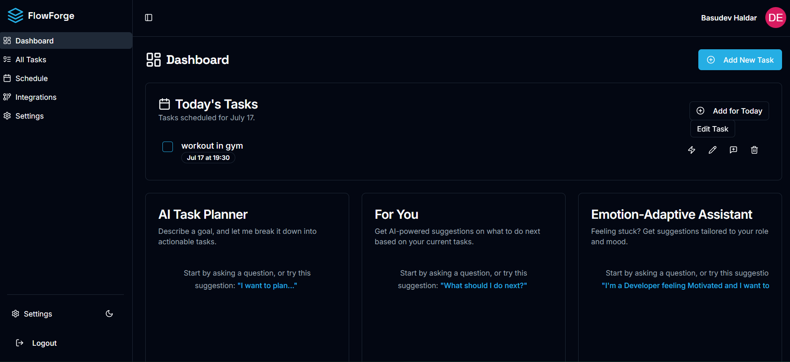
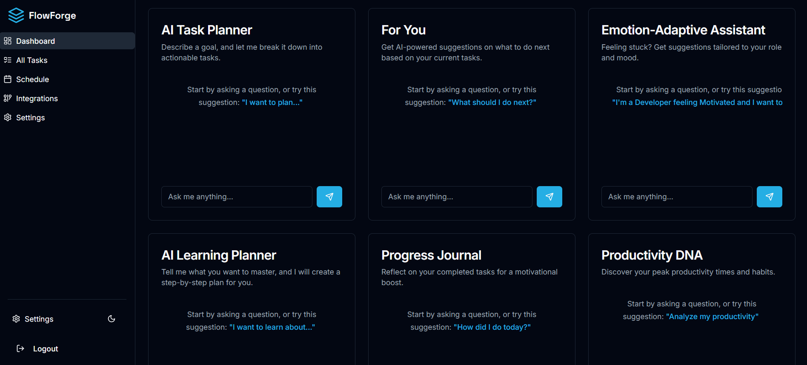
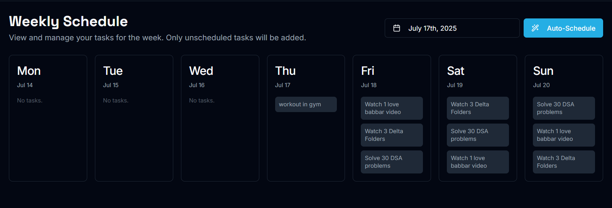

# FlowForge

FlowForge is an intelligent daily productivity system that goes far beyond a traditional to-do list. It blends AI-powered planning, scheduling, and motivation into one powerful interface—designed for users who want to accomplish more with structure, focus, and purpose.

## 🌟 Key Features

### ✅ Smart Task Management
- Add, edit, and delete tasks.
- Schedule tasks for specific dates and times.
- Organize tasks across views: **All Tasks**, **Today**, **This Week**.
- Sort tasks by time, importance, or category.

### 🧠 Gemini AI-Powered Sections
- **AI Task Planner**: Turn your goals into step-by-step tasks with AI help.
- **"For You" Suggestions**: Get real-time, AI-generated next steps.
- **Emotion-Adaptive Assistant**: Mood-aware productivity nudges.
- **Learning Planner**: Describe a skill or topic, get a customized learning path.
- **Progress Journal**: Reflect on what you've completed for motivation.
- **Productivity DNA**: Discover your best working patterns and times.
## 📸 Screenshots

### ✨ Home Screen

### 🧠 AI Task Planner

### 🧠 AI Week Scheduler

### 🧩 Future Smart Integrations (coming soon)
- Google Calendar, Notion, GitHub, Slack, Gmail, Telegram.
- Turn emails, messages, and issues into trackable tasks automatically.

### 🔥 UX Highlights
- Clean, minimal, distraction-free UI.
- Gemini API integrated chat experience with task injection capabilities.
- Firebase-backed secure real-time data sync.

## 🚀 Tech Stack

- **Frontend**: Next.js 14, TailwindCSS, Shadcn UI
- **AI**: Gemini API by Google AI
- **Backend**: Firebase (Authentication + Firestore)
- **Hosting**: Vercel

## 🛡️ License
This project is licensed under the MIT License – see the [LICENSE.md](LICENSE.md) file for details.

## 👤 Author
**Basudev Haldar**
- GitHub: [@dev628140](https://github.com/dev628140)
